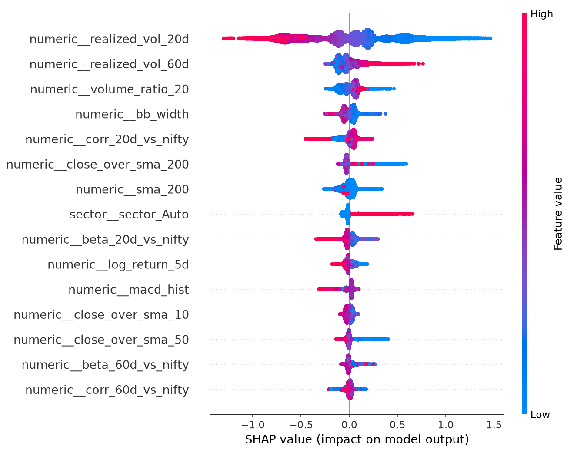
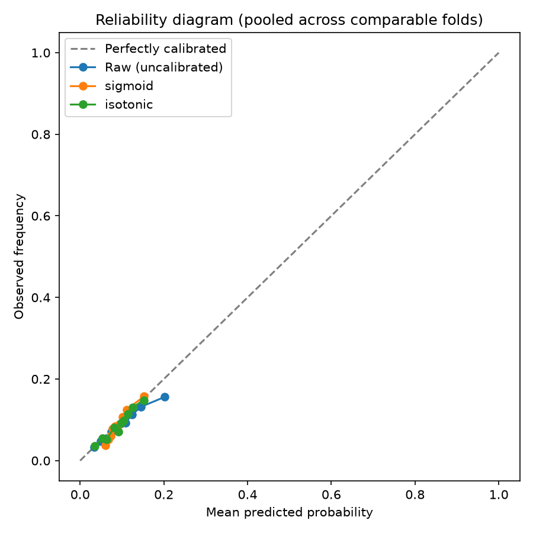
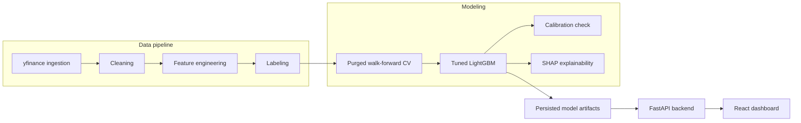

# Market & Commodities Intelligence Dashboard

[](https://github.com/nakulgrover118/market-intelligence-dashboard/actions/workflows/ci.yml)

Repo: [github.com/nakulgrover118/market-intelligence-dashboard](https://github.com/nakulgrover118/market-intelligence-dashboard) · Live demo: [market-intelligence-dashboard-two-lilac.vercel.app](https://market-intelligence-dashboard-two-lilac.vercel.app) (free-tier backend may take ~50s to wake up — see [`docs/deployment.md`](docs/deployment.md) for what this deployment deliberately simplifies)

A probabilistic forecasting system for NSE equities, indices, and gold/silver
ETF proxies. Instead of BUY/SELL signals, it estimates **calibrated
probabilities** of a large price move over fixed horizons — and is explicit,
throughout, about what that probability does and doesn't mean.

This project is built as a rigor-first case study: every phase is tested
against real data, every methodology decision is documented with its
trade-offs, and every result — including the negative ones — is reported
honestly. The full decision log and findings live in
[`docs/roadmap.md`](docs/roadmap.md); this README is the front door.

## The headline result

| Model | 5-day ROC-AUC | 5-day Brier | 20-day ROC-AUC | 20-day Brier |
|---|---|---|---|---|
| Naive (predict the historical base rate) | 0.500 | 0.0804 | 0.500 | 0.0924 |
| Logistic regression | 0.610 | 0.0811 | 0.618 | 0.0948 |
| **Tuned LightGBM (up)** | **0.624** | **0.0796** | **0.640** | 0.0925 |
| Tuned LightGBM (down) | 0.611 | 0.0658 | 0.612 | 0.0653 |

The dashboard trains and serves **two independent models per horizon** —
`P(move up)` and `P(move down)`, off the same symmetric volatility
threshold — not one model relabeled two ways. That distinction turned out to
matter: per-instrument positive rates are consistently higher on the up side
than the down side (e.g. `TCS.NS` at 5d: 9.3% up vs. 7.0% down), a real,
expected consequence of applying a symmetric threshold to assets with
positive long-run drift, not a labeling bug (Phase 12, `docs/roadmap.md`).

Tuned LightGBM is the first model in the project to actually beat the naive
baseline on Brier score, not just on ranking. Getting there required two
real pivots along the way, not a straight line:

- The original label threshold (a well-balanced ~33% positive rate) turned
  out to carry **no real signal** (AUC ~0.55) — a diagnostic detour found
  that predictability lives in larger, less noise-dominated moves, and the
  threshold was revised accordingly (see roadmap, Phase 4d).
- SHAP explainability then revealed that a meaningful part of even the
  *revised* model's edge is **volatility-regime detection**, not pure
  directional signal — confirmed quantitatively in the regime-stratified
  backtest (Phase 7 & 8). The dashboard says this explicitly, not just in
  the docs.

<p>
  
  
</p>

## Architecture



Data flows one direction, batch-style: the API never trains on request — it
serves from artifacts persisted by an offline pipeline (see
[`docs/deployment.md`](docs/deployment.md) for exactly how to run it).

## Methodology highlights

- **Probabilistic target, not a signal**: `P(forward N-day return >= k * volatility * sqrt(N))`, a volatility-scaled threshold chosen so "large move" means roughly the same statistical thing across 23 instruments with very different volatility — not a fixed percentage.
- **Walk-forward validation only**, with purging and embargo: no shuffled k-fold anywhere, and training rows whose label window overlaps the test period are explicitly excluded using each row's exact label end-date.
- **Every finding is a real, run finding**, not a projection: two real data bugs were found and fixed (Tata Motors' 2025 demerger breaking a ticker; a listed ETF with a year of vendor placeholder data), and one structural bug in the modeling pipeline was caught by an unexpectedly low warm-up rate before it silently corrupted training data.
- **Calibration was checked, not assumed**: Platt scaling and isotonic regression were fit and evaluated properly — and found not to help, a result reported as-is rather than forced into a positive story.
- **The decision-value backtest is scoped as research, not a product feature**: framed explicitly as illustrative due-diligence ("would acting on this probability have survived transaction costs"), consistent with the project's stated goal of probabilities over signals.
- **A single upside probability can't honestly answer "bullish or bearish?"** — a low value could mean "calm market" just as easily as "expect a drop." The fix, once real user feedback surfaced this, was a genuine second model (`P(forward return <= -threshold)`), not a relabel of the existing one. Both are always shown together in the UI, with a spread-based "lean" label rather than "whichever number is bigger" — because the two can be simultaneously elevated (confirmed live: `HDFCBANK.NS` showed up=16.6% / down=12.9% at once, both driven by the same low realized-volatility reading, which is the same volatility-regime effect Phase 7 found for the upside model alone).

Full write-up, including exact numbers for every claim above, is in
[`docs/roadmap.md`](docs/roadmap.md).

## Quickstart

```bash
# Backend
cd backend
python -m venv .venv && .venv/Scripts/activate  # or source .venv/bin/activate on macOS/Linux
pip install -e ".[dev]"
pytest                              # 143 tests, all against synthetic/mocked data
python -m app.data.ingest           # fetch raw data (needs network) — see docs/deployment.md for the full pipeline
python -m app.data.clean
python -m app.features.build
python -m app.features.labels
python -m app.models.persist        # tune + train + save the models the API serves
uvicorn app.main:app --reload

# Frontend (separate terminal)
cd frontend
npm install
npm run dev                         # http://localhost:5173
```

See [`docs/deployment.md`](docs/deployment.md) for containerized/hosted
deployment, and [`backend/README` sections above / `frontend/README.md`](frontend/README.md)
for frontend-specific notes.

## Project layout

```
backend/        FastAPI service — data pipeline, features, models, API
  app/data/       ingestion, cleaning, universe definition, path config
  app/features/   technical indicators, cross-asset features, labeling
  app/models/     dataset assembly, CV, baseline/GBM models, calibration, SHAP, backtest
  app/api/        FastAPI routes + schemas
  app/services/   model registry (persisted-artifact serving)
  tests/          143 tests, no network/data dependency
frontend/       React + TypeScript (Vite) dashboard
docs/
  roadmap.md      full phase-by-phase methodology log and findings — the real story
  deployment.md   how to actually run/deploy this
data/           gitignored (raw/processed/features/labels/models); data/results/ is tracked
```

## Tech stack

Python 3.11, pandas, scikit-learn, LightGBM, SHAP, FastAPI · React, TypeScript, Vite, Recharts · GitHub Actions CI

## Status

All 12 phases are complete: data pipeline, features, labeling, baseline +
tuned models, calibration, explainability, backtesting, API, frontend,
CI/deployment docs, and — following real user feedback that a single
upside-only probability read as ambiguous — a genuinely independent downside
(bearish) model shown alongside the upside one. See
[`docs/roadmap.md`](docs/roadmap.md) for the complete, phase-by-phase build
log.
